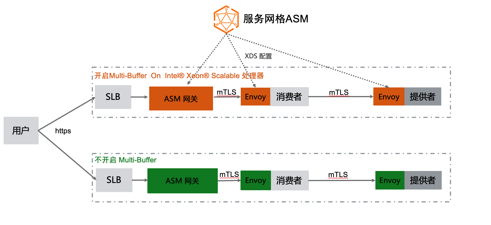
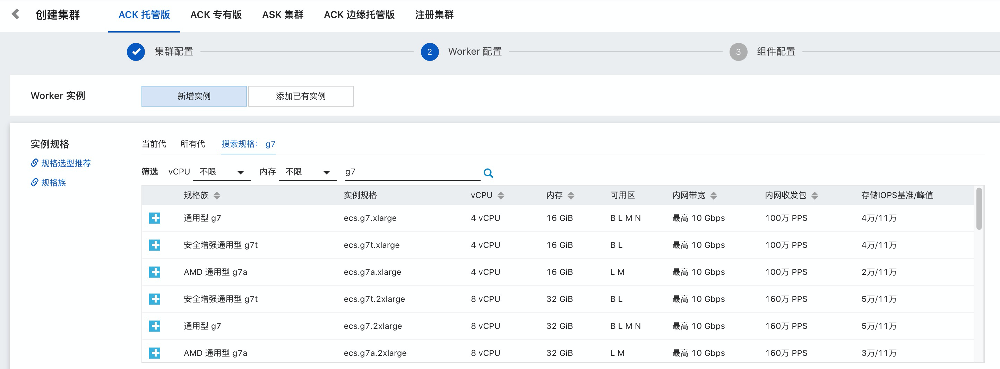

# Alibaba Service Mesh Product ASM Pro Adopts AVX512 and Multi-Buffer feature

## Demo Architecure

ASM Demo：

 

## Multi-Buffer 技术

这种技术的原理是使用 Intel CPU AVX-512 指令同时处理多个独立的缓冲区，即可以在一个执行周期内同时执行多个加解密的操作，加解密的执行效率便会得到成倍的提升。Multi-Buffer 技术不需要额外的硬件，只需要 CPU 包含特定的指令集即可。在 2021 年发布的 Ice Lake 处理器中已经包含了最新的 AVX-512 指令集， 目前已经在阿里云提供。

在创建ACK /ASK 集群时，采用通用型 g7 类型的即可

## ASM 集成实现

开启Multi-Buffer 功能前后性能测试对比有100% 的QPS 性能提升；

可根据 DEMO.md 下的指引进行验证测试；

## FAQ

- 如果开启了MultiBuffer 功能，但数据面集群不是Intel Ice Lake 的机型会怎么样？

  Envoy 会打印一个warning 日志， 如下：

  ###### 

具体什么样规格的机型采用Intel Ice Lake CPU ，可以参考: https://help.aliyun.com/document_detail/25378.html